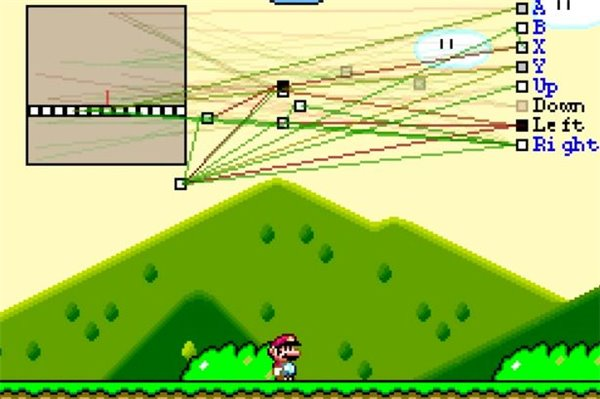
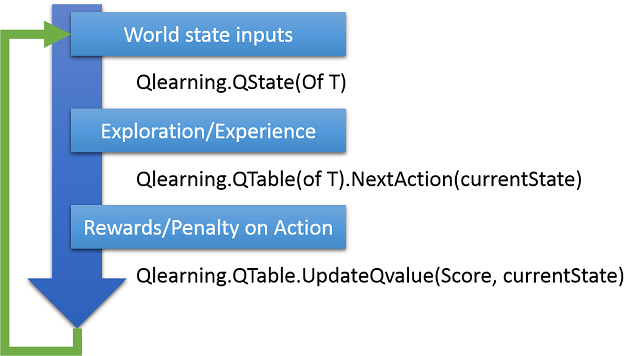
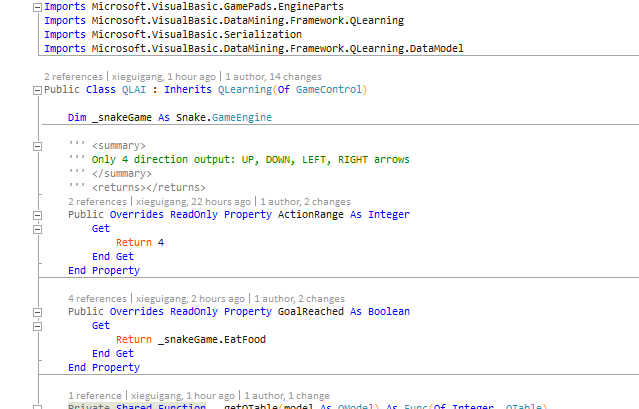
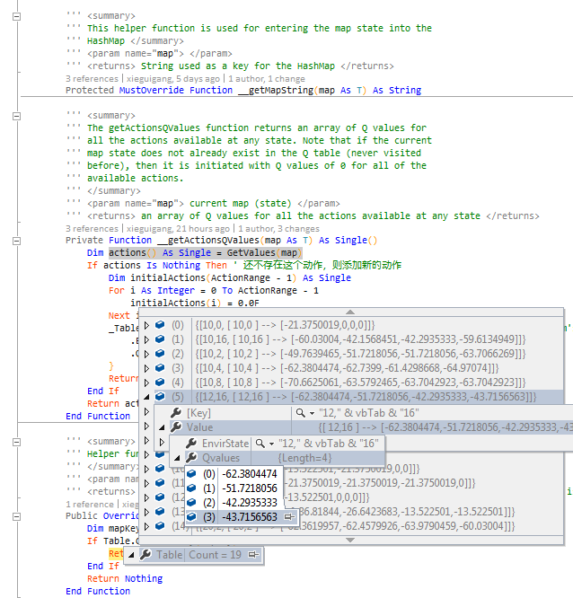
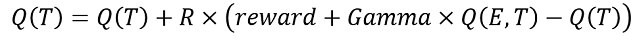
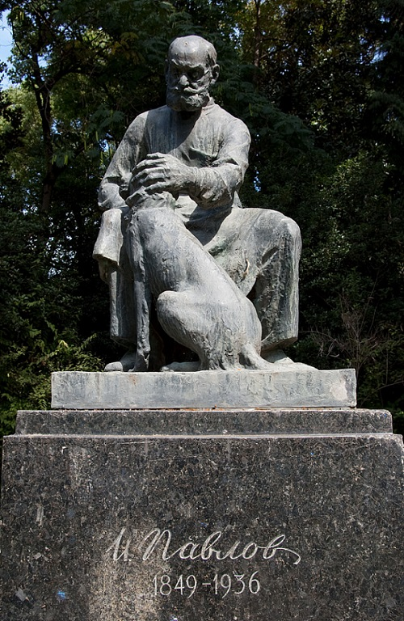

# VisualBasic Machine Learning, Step 1: The Q-Learning

> CodeProject: http://www.codeproject.com/Articles/1088282/VisualBasic-Machine-Learning-Step-The-Q-Learning

## Introduction
The Google AlphaGO draws the attention of the whole world over the past few Weeks, an artificial neural network shows his remarkable ability, with the deep learning technology, AlphaGO even beat the one of the world's top go chess player.
Currently the AI which makes us though him is a human is still only exists in the movies, as our world is much complex for the AI program to processing. The world in a video game is a simplify version of our real world, we could not create a human like Ai for the real world, but create a player AI in the gaming world is possible.
As to me, my most joyful thing is playing the video game, and the Mario game is my most favorite as the NES game Mario brother accompany me spent my childhood. A Mario game machine player MarI/O made by Seth Bling by using the evolutionary neuron network technology inspire me steps into the area of machine learning.

MarI/O video:  [https://www.youtube.com/watch?v=qv6UVOQ0F44](https://www.youtube.com/watch?v=qv6UVOQ0F44)


> By using neuro-evolution to makes the machine learn to play Mario game

Inspired by the greate work of MarI/O, I decided to developed my own AI engine framework, not for some serious research, just for fun and satisfy my personal hobby.

## Q-Learning Details
The Q-Learning is a kind of mode-free machine learning algorithm, and it is the most simple algorithm in the ML for the machine-learning beginners like me. Generally, there are 3 steps in the Q-Learning in total:



> How the QL_AI works: Overviews of the 3 steps in the Q-Learning

### Phase 1: Input the Environment state

How does the snake see the world?

For generates the environment state as input, the snake must see the world at first. As the MarI/O just modelling the world by abstract the game world as some blocks to simplify the state input, so that in this snake game, we just abstract the world as two point: the head of the snake and his food if no considering of the deadly wall or some block obstacles. This two point just perfectly modeling the snake and the world outside. Considering that we just want to training the snake to eat food, so that we just needs teaching the snake how get close to the food, there are 2 elements for generates the states for QTable can generates a identity state:

1. The relative position description between the snake and food
2. The snake its current movement direction

So that we can easily makes the snake to see the world by just simply exports the snake position and the food position for the QL_AI

```vbnet
' Get environment state as input
Dim pre = Distance(_snakeGame.Snake.Location, _snakeGame.food.Location)

Call _stat.SetState(_stat.GetNextState(Nothing))
```

```vbnet
Imports Microsoft.VisualBasic.DataMining.Framework.QLearning
Imports Microsoft.VisualBasic.GamePads.EngineParts
Imports Microsoft.VisualBasic.GamePads

''' <summary>
''' Environment state inputs
''' </summary>
Public Structure GameControl : Implements ICloneable

    ''' <summary>
    ''' The relative position between the head of the snake and his food
    ''' </summary>
    Dim position As Controls
    ''' <summary>
    ''' The current movement direction of the snake.(蛇的当前运动方向)
    ''' </summary>
    Dim moveDIR As Controls

    ''' <summary>
    ''' hash key for the QTable
    ''' </summary>
    ''' <returns></returns>
    Public Overrides Function ToString() As String
        Return $"{CInt(position)},{vbTab}{CInt(moveDIR)}"
    End Function

    Public Function Clone() As Object Implements ICloneable.Clone
        Return New GameControl With {
            .position = position,
            .moveDIR = moveDIR
        }
    End Function
End Structure

Public Class QState : Inherits QState(Of GameControl)

    Dim game As Snake.GameEngine

    Sub New(game As Snake.GameEngine)
        Me.game = game
    End Sub

    ''' <summary>
    ''' The position relationship of the snake head and his food consists of 
    ''' the current environment state
    ''' </summary>
    ''' <param name="action">当前的动作</param>
    ''' <returns></returns>
    Public Overrides Function GetNextState(action As Integer) As GameControl
        Dim pos As Controls = Position(game.Snake.Location, game.food.Location, False)
        Dim stat = New GameControl With {
            .moveDIR = game.Snake.Direction,
            .position = pos
        }  ' 当前的动作加上当前的状态构成q-learn里面的一个状态
        Return stat
    End Function
End Class
```

### Phase 2: Output controls

The algorithm core of the Q-Learning is the QTable, QTable consists of basically two elements: the environment state and the actions’ q-values relative to a specific environment state. The index of the elements in the action state object in the code for the action, examples as 0 stands for action up, 1 for action down, etc… Due to the reason of the action output of the Q-Learning just only have 4 direction controls: Up, Down, Left and right, so that the QTable its action range is 4



#### The basic of QTable

```vbnet
Imports System
Imports System.Collections
Imports System.Collections.Generic
Imports Microsoft.VisualBasic.DataMining.Framework.QLearning.DataModel
Imports Microsoft.VisualBasic

Namespace QLearning

    ''' <summary>
    ''' The heart of the Q-learning algorithm, the QTable contains the table
    ''' which maps states, actions and their Q values. This class has elaborate
    ''' documentation, and should be the focus of the students' body of work
    ''' for the purposes of this tutorial.
    '''
    ''' @author A.Liapis (Original author), A. Hartzen (2013 modifications); 
    ''' xie.guigang@gcmodeller.org (2016 modifications)
    ''' </summary>
    Public MustInherit Class QTable(Of T As ICloneable)
        Implements IQTable

        ''' <summary>
        ''' the table variable stores the Q-table, where the state is saved
        ''' directly as the actual map. Each map state has an array of Q values
        ''' for all the actions available for that state.
        ''' </summary>
        Public ReadOnly Property Table As Dictionary(Of Action) Implements IQTable.Table

        ''' <summary>
        ''' the actionRange variable determines the number of actions available
        ''' at any map state, and therefore the number of Q values in each entry
        ''' of the Q-table.
        ''' </summary>
        Public ReadOnly Property ActionRange As Integer Implements IQTable.ActionRange

#Region "E-GREEDY Q-LEARNING SPECIFIC VARIABLES"
 
        ''' <summary>
        ''' for e-greedy Q-learning, when taking an action a random number is
        ''' checked against the explorationChance variable: if the number is
        ''' below the explorationChance, then exploration takes place picking
        ''' an action at random. Note that the explorationChance is not a final
        ''' because it is customary that the exploration chance changes as the
        ''' training goes on.
        ''' </summary>
        Public Property ExplorationChance As Single = 0.05F Implements IQTable.ExplorationChance
        ''' <summary>
        ''' the discount factor is saved as the gammaValue variable. The
        ''' discount factor determines the importance of future rewards.
        ''' If the gammaValue is 0 then the AI will only consider immediate
        ''' rewards, while with a gammaValue near 1 (but below 1) the AI will
        ''' try to maximize the long-term reward even if it is many moves away.
        ''' </summary>
        Public Property GammaValue As Single = 0.9F Implements IQTable.GammaValue
        ''' <summary>
        ''' the learningRate determines how new information affects accumulated
        ''' information from previous instances. If the learningRate is 1, then
        ''' the new information completely overrides any previous information.
        ''' Note that the learningRate is not a final because it is
        ''' customary that the learningRate changes as the
        ''' training goes on.
        ''' </summary>
        Public Property LearningRate As Single = 0.15F Implements IQTable.LearningRate
```

For example, on the code screenshot show above, Table variable in the QTable class, its key is a string that can representatives some environment state, and the value of the dictionary is actions’ q-value. There are 4 values in each element in the dictionary in this snake game, its q-value element index stands for the 4 direction button on the joypad, and the q-value determine the program press which direction button is the best action.  

> At the QTable its initial state, there is no element in the QTable dictionary, but with the game continued playing, more and more environment states will be store in theQTable , so that you can considered the QTable as one man his experience on doing something.

#### Exploration or Experience

In this QL_AI snake game controller program, we are using the e-greedy approach algorithm to make a choice of the program how to deal with current environment state: Trying a new exploration or action based on the previous experience:

```vbnet
''' <summary>
''' For this example, the getNextAction function uses an e-greedy
''' approach, having exploration happen if the exploration chance
''' is rolled.
''' ( **** 请注意，这个函数所返回的值为最佳选择的Index编号，所以可能还需要进行一些转换 **** )
''' </summary>
''' <param name="map"> current map (state) </param>
''' <returns> the action to be taken by the calling program </returns>
Public Overridable Function NextAction(map As T) As Integer
    _prevState = CType(map.Clone(), T)

    If __randomGenerator.NextDouble() < ExplorationChance Then
        _prevAction = __explore()
    Else
        _prevAction = __getBestAction(map)
    End If

    Return _prevAction
End Function
```

#### Defines the best action

As the description above, the algorithm core of the Q-Learning is the q-value (rewards and penalty) for the actions on a specific environment state applied to the QTable object, so that we should define a action object to represents the best action under a specific environment state:

```vbnet
Imports Microsoft.VisualBasic.ComponentModel.Collection.Generic
Imports Microsoft.VisualBasic.Serialization

Namespace QLearning

    ''' <summary>
    ''' One specific environment state have some possible actions,
    ''' but there is just one best action on the current environment state based on the 
    ''' accumulate q-values
    ''' </summary>
    Public Class Action : Implements sIdEnumerable

        ''' <summary>
        ''' The environment variables state as inputs for the machine.
        ''' </summary>
        ''' <returns></returns>
        Public Property EnvirState As String Implements sIdEnumerable.Identifier
        ''' <summary>
        ''' Actions for the current state.
        ''' </summary>
        ''' <returns></returns>
        Public Property Qvalues As Single()

        ''' <summary>
        ''' Environment -> actions' Q-values
        ''' </summary>
        ''' <returns></returns>
        Public Overrides Function ToString() As String
            Return $"[ {EnvirState} ] {vbTab}--> {Qvalues.GetJson}"
        End Function

    End Class
End Namespace
```

For the class code definition above, we are known that in the current environment state EnvirState, the program that have some action choice, which the action is encoded as the index in the Qvalues array, and the array elements in the Qvalues property represents the action rewards on the current state EnvirState, the higher value of the element in the Qvalues means the higher reward of the action on current state. so that we just let the program returns the index of the max value in the Qvalues, and this index can be decoded as the best action. Gets the best action in the current state just like the function actions below:

```vbnet
''' <summary>
''' The getBestAction function uses a greedy approach for finding
''' the best action to take. Note that if all Q values for the current
''' state are equal (such as all 0 if the state has never been visited
''' before), then getBestAction will always choose the same action.
''' If such an action is invalid, this may lead to a deadlock as the
''' map state never changes: for situations like these, exploration
''' can get the algorithm out of this deadlock.
''' </summary>
''' <param name="map"> current map (state) </param>
''' <returns> the action with the highest Q value </returns>
Private Function __getBestAction(map As T) As Integer
    Dim rewards() As Single = Me.__getActionsQValues(map)
    Dim maxRewards As Single = Single.NegativeInfinity
    Dim indexMaxRewards As Integer = 0

    For i As Integer = 0 To rewards.Length - 1
       ' Gets the max element value its index in the Qvalues

       If maxRewards < rewards(i) Then
          maxRewards = rewards(i)
          indexMaxRewards = i
       End If
    Next i

    ' decode this index value as the action controls
    Return indexMaxRewards
End Function
```

In this snake game, there are only just 4 direction key on the program's joypad, so that the Qvalues property in theAction class have 4 elements, stands for the q-value of each direction button that the machine program press.


> The 4 elements in the Qvalues represents the Q-value on each action.

After the best action its index was returns from theQtable based on the current environment state inputs, that we can decode the action index as the joypad controls of the snake:

```vbnet
Dim index As Integer = Q.NextAction(_stat.Current)
Dim action As Controls

Select Case index
    Case 0
        action = Controls.Up
    Case 1
        action = Controls.Down
    Case 2
        action = Controls.Left
    Case 3
        action = Controls.Right
    Case Else
        action = Controls.NotBind
End Select

Call _snakeGame.Invoke(action)
```

So that we can explained how does the program takes an action on the current environment states:

If the random is in the ranges of the ExplorationChance then the program will by take a random action to try exploring his new world

If not, then the program will make a decision of the best action based on the current environment state and the history in the QTable, that is him takes action based on the experience.

### Phase 3: Feedback (Learning or Adaptation)

As you can see in the __getBestAction function that show above, first, the program gets the q-value from current environment state, and then from the compares, the program he can choose an action index that would makes the rewards on that direction maximum.

#### Learning first step: see the world

For generates the experience on doing some thing for the program, a dictionary add method was implemented for adding the new environment state to the QTable, so that this makes the possible of program learn the new world.

```vbnet
''' <summary>
''' This helper function is used for entering the map state into the
''' HashMap </summary>
''' <param name="map"> </param>
''' <returns> String used as a key for the HashMap </returns>
Protected MustOverride Function __getMapString(map As T) As String

''' <summary>
''' The getActionsQValues function returns an array of Q values for
''' all the actions available at any state. Note that if the current
''' map state does not already exist in the Q table (never visited
''' before), then it is initiated with Q values of 0 for all of the
''' available actions.
''' </summary>
''' <param name="map"> current map (state) </param>
''' <returns> an array of Q values for all the actions available at any state </returns>
Private Function __getActionsQValues(map As T) As Single()
    Dim actions() As Single = GetValues(map)
    If actions Is Nothing Then ' 还不存在这个动作，则添加新的动作
        Dim initialActions(ActionRange - 1) As Single
        For i As Integer = 0 To ActionRange - 1
            initialActions(i) = 0.0F
        Next i

        ' If the current environment state is not in the program's memory, 
        ' then store it, this is the so called learn
        _Table += New Action With {  
              .EnvirState = __getMapString(map),
              .Qvalues = initialActions
        }
        Return initialActions
    End If
    Return actions
End Function
```

#### Learning step 2: Improvements on his experience 

For teaching a child, we often gives some rewards when the kids doing as we expected, so we did in the Q-Learning, we using the rewards to improving the program's experience on the action of the specific environment state:

```vbnet
''' <summary>
''' The updateQvalue is the heart of the Q-learning algorithm. Based on
''' the reward gained by taking the action prevAction while being in the
''' state prevState, the updateQvalue must update the Q value of that
''' {prevState, prevAction} entry in the Q table. In order to do that,
''' the Q value of the best action of the current map state must also
''' be calculated.
''' </summary>
''' <param name="reward"> at the current map state </param>
''' <param name="map"> current map state (for finding the best action of the
''' current map state) </param>
Public Overridable Sub UpdateQvalue(reward As Integer, map As T)
    Dim preVal() As Single = Me.__getActionsQValues(Me._prevState)
    preVal(Me._prevAction) += Me.LearningRate * (reward + Me.GammaValue * Me.__getActionsQValues(map)(Me.__getBestAction(map)) - preVal(Me._prevAction))
End Sub
```

The Update Q value function can be express as the formula below:



Where Q is the q-values of the actions on the previous environment state, T is the best action of the previous environment state. R stands for the learning rate, E is the current environment state. 

If the program's action makes him approach to our goal, then we update the actions q-value with rewards, if not then we update the actions q-value with penalty score. so that after several time training loops, the program will action as we expected, The Q-Learning just action like the dog's classical conditioning.  


> Classical conditioning: A statue of Ivan Pavlov and one of his dogs

## Running the example

For saving you time on running this example, you can down the trained snake QL_AI QTable data from this link

> https://github.com/xieguigang/VB_GamePads/tree/master/AI/DATA

And using the following command to start the snake with the trained data:

```bash
snakeAI /start /load "filepath-to-the-download-dataset"
```

Otherwise, you also can train the snake fresh, From the beginning to trains the snake, just double click on the snake application, it will be start running at a fresh state.


In this article just trying to explain the basic concepts of the machine learning from a most simple snake game, and I hope you could get the ideas of build a more powerful AI program that can dealing with the more complex environment situation.

Hope you could enjoy! ;-)