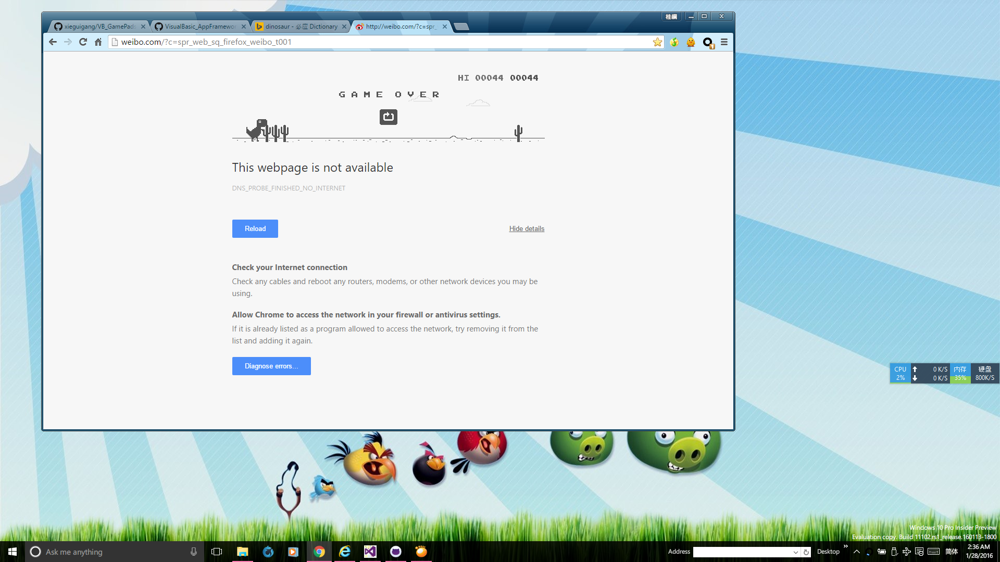
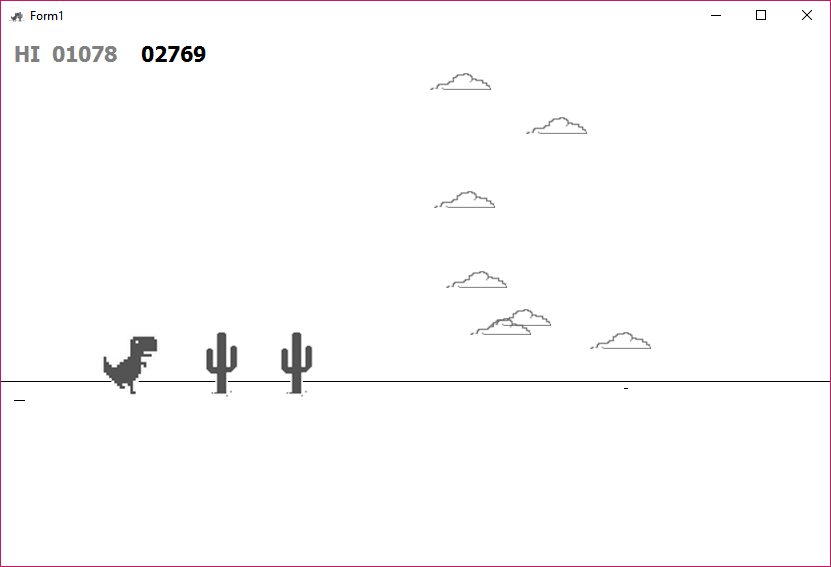

# VB_GamePads

Simple Framework to create game. I using this framework to testing the machine learning AI.

+ 
+ 

#### Development Note

###### Required of dependence

+ Install nuget package sciBASIC#: [https://github.com/xieguigang/sciBASIC](https://github.com/xieguigang/sciBASIC)

  > PM> Install-Package sciBASIC -Pre

###### Sound Driver

For correctly initialize the sound driver, you must change the solution CPU type configuration to ``x86``

###### Screenshots

