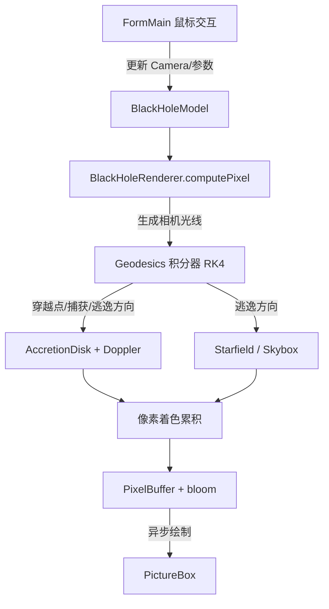

## 用户需求

基于已有源码项目（Astrophysics 光线追踪模块、Microsoft.VisualBasic.Imaging Drawing3D 三维渲染、physics 物理引擎）的 API，在 BlackHole 项目文件夹中实现一台三维黑洞模拟器。

## 产品概述

一台桌面端（WinForms）三维黑洞实时可视化程序：以光线追踪方式沿弯曲时空的零测地线追踪每一条视线，实时渲染黑洞的引力透镜现象。支持史瓦西（非旋转）与克尔（旋转）两种黑洞模型，通过自旋参数 a 切换。

## 核心功能

- 相机交互：鼠标左键拖拽旋转观察视角（俯仰/偏航），滚轮缩放观察距离，右键拖拽平移观察位置。
- 黑洞阴影：视线被事件视界捕获时呈现黑色区域（含光子环放大效应）。
- 光子球：不稳定光子轨道（史瓦西下 r≈1.5Rs）在阴影边缘形成明亮光子环/多重像。
- 吸积盘：赤道面薄盘，按 Shakura-Sunyaev 温度分布着色（内蓝外红），叠加引力透镜形成的上下镜像。
- 多普勒效应：吸积盘物质相对论性轨道运动导致视线方向蓝移增亮、背离方向红移变暗（相对论性集束/beaming）。
- 星空背景：程序化星点，并保留加载 Skybox 贴图能力；逃逸视线按透镜后方向采样背景。
- 参数面板：自旋 a 滑块、吸积盘开关、渲染分辨率等，实时重绘。

## 技术栈

- 语言/框架：Visual Basic .NET（WinForms，net10.0-windows），与现有 BlackHole.vbproj 一致。
- 复用 API：
- `Astrophysics.raytracing`：`Renderer.computePixelInfo` 的相机光线生成数学（`eyePos=(0,0,-1/tan(FOV/2))`、`rayDir=((u,v,0)-eyePos).Normalize().RotateYawPitch(cam.AngleY,cam.AngleX)`、起点 `cam.position`）、`PixelBuffer`/`PixelData`/`Color`、`Skybox`（含默认渐变回退）、`GaussianBlur`（bloom）。
- `Microsoft.VisualBasic.Imaging.Drawing3D`：`Camera`（position/AngleX/AngleY/AngleZ/ViewDistance/FieldOfView/Screen）、`Point3D`（Add/Subtract/Multiply/Divide/Normalize/Length/Dot/Cross/RotateYawPitch/Distance）矢量数学。
- `framework\gr\physics`：作为矢量/粒子类型的可选参考；但相对论测地线需自定义积分，不使用其牛顿引擎以免物理错误。

## 实现方案

### 总体策略

以「逐像素零测地线追踪 + 物理着色合成 + bloom 辉光」替代 Astrophysics 原有「直线射线 vs Solid」的 raycast。相机光线生成与像素输出管线完全复用既有 Renderer 模式，仅将几何求交替换为时空测地线积分，从而最大限度复用现有约定（PixelBuffer 循环、ScreenUV 归一化、bloom 后处理）。

### 测地线积分（核心物理）

- 史瓦西（Rs=1 几何单位）：3D 笛卡尔下光子加速度 `a = -1.5 * h2 * r_vec / |r|^5`，其中 `h2 = |r × v|²`（守恒角动量平方）。RK4 步进取 `dt≈0.05~0.1`，逐项检测：
- `|r| < Rs` → 视界捕获，返回黑色（构成阴影）；
- 跨赤道面 `y` 变号且 `r ∈ [Rin, Rout]` → 记录吸积盘穿越点（保留多次穿越以呈现盘前后多重像与光子环）；
- `|r| > Rmax`（如 50·Rs）且仍自由 → 以当前方向作为背景采样方向。
- 克尔（a≠0）：采用 Boyer-Lindquist 坐标下基于守恒量 (E, Lz, Q) 的一阶 Hamilton 方程组（Carter 常数分离），`a=0` 时退化为史瓦西；自旋参数 a 由 BlackHoleModel 统一注入，渲染器无需改动结构。

### 吸积盘与多普勒

- 盘温 `T(r) ∝ r^(-3/4)` 映射黑体色；轨道速度取几何单位开普勒 `v=√(M/r)`（克尔下按 ISCO 与帧拖曳修正）。
- 相对论多普勒因子 `δ = 1 / [γ(1 - β·n)]`，增亮 `I ∝ δ^(3+α)`（α≈1），叠加引力红移 `√(1-Rs/r)`，实现蓝移增亮/红移变暗。
- 盘穿越点依次累积发光后继续积分，确保透镜多重像正确。

### 性能与可靠性

- 低分辨率缓冲（0.3~0.5 倍）渲染后上采样；后台 `Task`/异步渲染，相机/参数变动即取消旧任务避免竞态。
- 逐步积分上限步数 + 提前终止（逃逸/捕获）控制最坏耗时；bloom 仅作用于高发射像素（`filterByEmission`）。
- 复用既有 `Color`/`GaussianBlur`，不重复造轮子；错误处理：Skybox 加载失败回退程序化星空，绝不抛异常中断渲染。

## 架构设计



## 目录结构与文件职责（BlackHole 项目）

```
g:/pixelArtist/src/BlackHole/
├── Geodesics.vb            # [NEW] 零测地线积分器。RK4 推进光子；Schwarzschild(a=0)与 Kerr(a参数) 两套方程；返回捕获/盘穿越/逃逸结构化结果。复用 Point3D 矢量运算。
├── BlackHoleModel.vb      # [NEW] 模型参数中心：质量/M、Rs、自旋 a、盘内外半径 Rin/Rout、盘倾角、Camera 状态、Starfield、渲染分辨率与 bloom 参数；提供相机光线起点/方向构造（复用 Renderer 数学）。
├── AccretionDisk.vb       # [NEW] 吸积盘几何与物理：赤道面薄盘命中判定、温度→黑体色、开普勒轨道速度场（克尔下含帧拖曳修正）。
├── Doppler.vb             # [NEW] 相对论多普勒 + 引力红移 + beaming 计算；输入盘点位置/速度/视线，输出 δ 与增亮系数。
├── Starfield.vb          # [NEW] 程序化星点背景（哈希噪声生成恒星），并封装可选 Skybox 贴图加载（复用 Astrophysics.raytracing.Skybox.getColor）。
├── BlackHoleRenderer.vb   # [NEW] 渲染核心：逐像素生成相机光线→调用 Geodesics→合成盘发光(Doppler)/阴影/透镜背景→输出 PixelBuffer；提供 renderToPixels/异步渲染入口；复用 GaussianBlur 做盘辉光。
├── FormMain.vb           # [MODIFY] 主窗体逻辑：控件绑定、鼠标左拖旋转/滚轮缩放/右键平移、参数变更触发异步重绘、状态栏显示相机与模型参数。
└── FormMain.Designer.vb  # [MODIFY] 控件布局：PictureBox 画布、自旋 a 滑块、吸积盘开关、分辨率下拉、状态标签；深色太空主题。
```

## 关键代码结构（接口级）

```
Namespace BlackHole

    ' 单条光子积分的结构化结果
    Public Structure PhotonResult
        Public Captured As Boolean          ' 被视界捕获（阴影）
        Public DiskHits As List(Of DiskHit) ' 多次赤道面穿越（多重像）
        Public EscapeDir As Point3D         ' 逃逸视线方向（背景采样）
    End Structure

    ' 测地线积分器（史瓦西/克尔统一入口，a 控制自旋）
    Public Class Geodesics
        Public Shared Function Trace(origin As Point3D,
                                     direction As Point3D,
                                     model As BlackHoleModel) As PhotonResult
        ' RK4 逐步推进；a=0 退化为史瓦西
        End Function
    End Class

End Namespace
```

## 设计风格

桌面端（Windows 桌面，非移动端）黑洞观测台风格。采用深空暗色主题 + 玻璃拟态控制面板，整体氛围为「宇宙观测仪表盘」：深黑背景衬托吸积盘的橙红辉光与光子环冷蓝高光。主画布为沉浸式全屏星空视图，右侧悬浮半透明控制面板，底部细状态栏。

## 页面/窗口规划（单窗体，自上而下区块）

1. 顶部导航条：程序标题「Black Hole Simulator」、模型切换（史瓦西/克尔）、重置视角按钮，浅玻璃条。
2. 主视区（PictureBox 画布）：占满剩余空间，实时显示黑洞渲染；叠加极简 HUD（左下角显示 FOV/距离/自旋 a）。
3. 右侧控制面板（玻璃拟态卡片）：自旋 a 滑块（0~0.998）、吸积盘开关、盘半径微调、渲染分辨率下拉（0.3/0.5/1.0）、bloom 强度。
4. 底部状态栏：相机坐标、俯仰/偏航角、FPS/渲染耗时、当前捕获状态提示。
5. 交互反馈：鼠标悬停控件高亮，滑块拖动时画布实时（或节流）重绘；旋转/平移时画布有轻微过渡，避免突兀。

## 字体系统（family: Roboto）

- 标题 heading：20px / 600
- 次级标题 subheading：14px / 500
- 正文 body：12px / 400

## 配色系统

- 主色 primary：吸积盘橙 #FF8A1E、冷蓝 UI 强调 #36D1DC、光子环冷白蓝 #BFD8FF
- 背景 background：深空 #05060A、面板 #0E1118、控件 #161B26
- 文本 text：主文本 #E8ECF4、次要 #8A94A6
- 功能色 functional：成功 #3DDC84、警告 #FFB020、错误 #FF5A5F、链接 #36D1DC