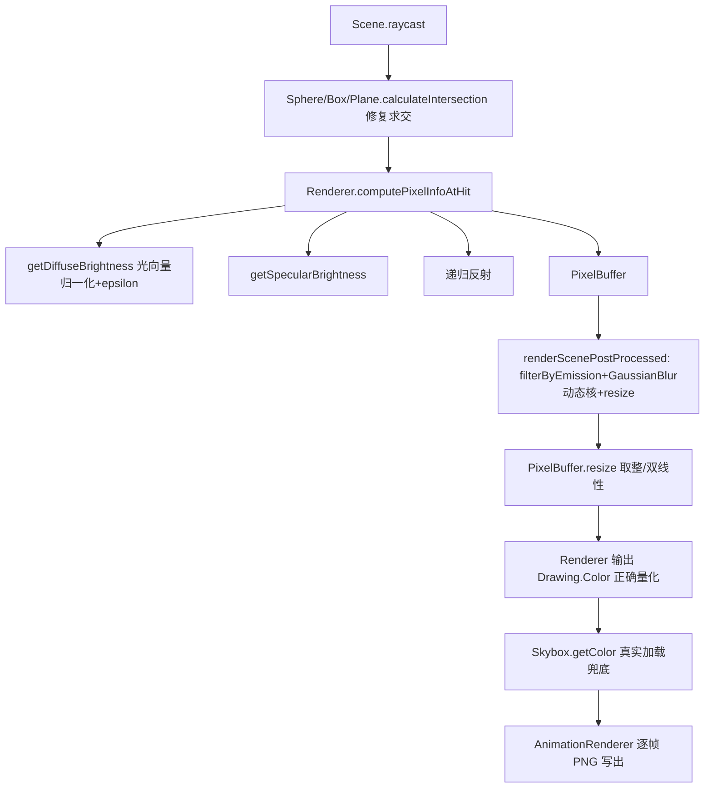

## 用户需求

对 VB.NET 天体物理引擎中的 raytracing 模块进行代码审查：定位并修复光线追踪算法中的错误，并补全模块内未完成（stub/注释占位）的代码。

## 产品概述

raytracing 是一个基于球体/盒子/平面等几何体的递归光线追踪渲染器，包含相机、光源、天空盒、像素缓冲与泛光后处理。本次任务只涉及算法正确性与缺失逻辑补全，不改动 framework 子模块与 Camera/Point3D 等框架 API。

## 核心功能

- 修复漫反射光照计算（光向量未归一化导致亮度随距离异常）。
- 修复像素输出颜色量化错误（`CInt(Red)*255` 截断导致中间色调丢失）。
- 修复球体/盒子求交在“相机位于物体内部”时的漏交与返回原点后方交点。
- 修复高斯模糊固定核与任意 radius 不匹配、浮点索引采样错误与边缘发暗。
- 修复 Color.RGB 属性对越界 UInt32 的 OverflowException。
- 修复 PixelBuffer.resize 未取整下标与未实现线性插值，以及浅拷贝/空像素统计问题。
- 补全 Skybox 图像加载与 getColor 安全兜底。
- 补全 AnimationRenderer 的逐帧渲染与 PNG 序列写出。

## 技术栈

- 语言：VB.NET（.NET Framework / net4.8，沿用 Astrophysics.vbproj）
- 渲染/图像框架：`Microsoft.VisualBasic.Imaging`（BitmapBuffer、Camera、Point3D），均为既有依赖，不新增第三方库
- 模块边界：仅修改 `g:/pixelArtist/src/PhysicsEngine/raytracing/` 下的 .vb 文件

## 实现方案

整体策略：在保持现有类结构与调用关系不变的前提下，定位并修正 7 类算法错误、补全 2 处未完成逻辑。所有修改均复现原有命名、常量与对外接口（如 `Renderer.renderScene`、`Skybox.getColor`、`AnimationRenderer.renderImageSequence`），避免破坏其它模块调用。

### 关键修复与决策

1. **漫反射亮度归一化（Renderer.getDiffuseBrightness）**：原 `vec3.Dot(hit.Normal, sceneLight.Position.Subtract(hit.Position))` 中光向量未归一化，亮度随到光源距离线性缩放。改为 `.Subtract(hit.Position).Normalize()`。同时给阴影射线起点沿光方向加 epsilon（如 1e-3）偏移，避免自阴影误判。
2. **像素颜色量化（Renderer.renderScene / renderScenePostProcessed）**：原 `CInt(pixelData.Color.Red) * 255` 先截断到 0/1 再乘 255，丢失全部中间调。改为 `CInt(pixelData.Color.Red * 255)`（三通道一致）；并做 0–255 钳制。
3. **球体求交（Sphere.calculateIntersection）**：原仅当 `t1 = t - x > 0` 返回近交点，相机在球内（`t1<0` 但 `t+x>0`）时漏交。改为 `near=t-x, far=t+x`；`far<=0` 无交；否则 `near>0` 取 near，否则取 far。
4. **盒子求交（Box.calculateIntersection）**：slab 法其余保留；当 `tnear<0` 且 `tfar>0`（起点在盒内）时回退返回 `tfar`，避免返回原点后方交点。
5. **高斯模糊（GaussianBlur）**：废弃固定 11 抽头核与浮点索引采样。改为按 `radius` 动态生成长度为 `2*radius+1` 的高斯核（`sigma=radius/2` 或标准公式），`blurHorizontally`/`blurVertically` 用整数索引 `kernel(i+radius)`；越界样本 clamp 到边界像素并整体除以核和，保证边缘不偏暗。
6. **Color.RGB 溢出（Color.vb）**：原 `CInt(&HFF000000UI)` 对越界 UInt32 抛 OverflowException。改用有符号常量 `Private Const ALPHA As Integer = -16777216`（`=&HFF000000`），再 `Or` 各通道移位值；`multiply(brightness)` 钳制逻辑保留为可选放开（当前调用方均≤1，非紧急）。
7. **PixelBuffer.resize**：用 `CInt(Math.Round(...))` 取整到合法下标（最近邻）；`linear=True` 时实现四邻域双线性加权；`clone` 改为逐像素深拷贝；`countEmptyPixels` 修正为统计单个 `Nothing` 像素。

### 未完成代码补全

8. **Skybox**：构造函数按 `resourceName` 用 `BitmapBuffer.FromImage(System.Drawing.Image.FromFile(resourceName))` 实际加载，成功置 `loadedField=True`，文件缺失仅记录并保留 `Nothing`；`getColor` 在 `sphereImage Is Nothing` 时返回基于方向的安全兜底色（中性天色），不再必崩；`reload`/`reloadFromFile` 真正加载目标图像。
9. **AnimationRenderer.renderImageSequence**：将 `outputDirectory` 由 `FileStream` 改为 `String`（输出目录）；逐帧用 first/second 的 position 与 yaw/pitch 插值设置 `scene.Camera`；调用 `Renderer.renderScene(scene, w, h)` 得到 PixelBuffer，逐像素写入新 `BitmapBuffer`（`Drawing.Color.FromArgb(p.Color.RGB)`），`frameBuffer.Save(Path.Combine(outputDirectory, frame & ".png"))`；postProcessing 开关复用 renderScenePostProcessed 的 bloom 合成逻辑（先渲染 buffer、filterByEmission、GaussianBlur、resize 叠加）。

## 实现要点（防回归）

- 仅修改 raytracing 模块，不动 framework 子模块与 `Camera`/`Point3D` 公共 API，保持向后兼容。
- 模糊与重采样为 O(宽×高×(2r+1))，单次渲染后处理原已如此，不引入额外复杂度；动态核长度随 radius 线性增长，沿用 bloomRadius=10 时核长 21，开销可控。
- 复用既有常量（`GLOBAL_ILLUMINATION`、`SKY_EMISSION` 等）与 `Color` 既有方法（`lerp`/`multiply`/`add`/`RGB`）。
- 修复后建议用现有 Scene（含 Sphere/Plane/Box + Skybox）渲染一帧验证颜色与阴影正常、无 NRE/溢出异常。

## 架构设计

渲染数据流（修复点标注）：



## 目录结构

```
g:/pixelArtist/src/PhysicsEngine/raytracing/
├── math/
│   ├── Ray.vb        # [MODIFY] 仅 Norm 行为核实，无需改动（保持）
│   └── RayHit.vb     # [MODIFY] 不变
├── pixeldata/
│   ├── Color.vb      # [MODIFY] 修复 RGB 属性溢出（ALPHA 常量），可选放开 multiply 钳制
│   ├── GaussianBlur.vb  # [MODIFY] 动态生成高斯核、整数索引、边缘 clamp 归一化
│   ├── PixelBuffer.vb  # [MODIFY] resize 取整/双线性、clone 深拷贝、countEmptyPixels 修正
│   └── PixelData.vb    # [MODIFY] 不变（add/multiply 逻辑已正确）
├── rendering/
│   ├── AnimationRenderer.vb  # [MODIFY] 补全逐帧渲染与 PNG 序列写出（outputDirectory 改 String）
│   ├── Light.vb            # [MODIFY] 不变
│   ├── Renderer.vb        # [MODIFY] 修复漫反射归一化+阴影偏移；修复两处颜色量化
│   ├── Scene.vb           # [MODIFY] 不变（raycast 逻辑正确）
│   └── Skybox.vb          # [MODIFY] 补全构造/reload 加载图像与 getColor 兜底
└── solids/
    ├── Box.vb       # [MODIFY] 修复盒内起点求交回退 tfar
    ├── Plane.vb     # [MODIFY] 不变（含方向退化处理已正确）
    ├── Solid.vb     # [MODIFY] 不变
    └── Sphere.vb    # [MODIFY] 修复球内起点求交（near/far 判定）
```